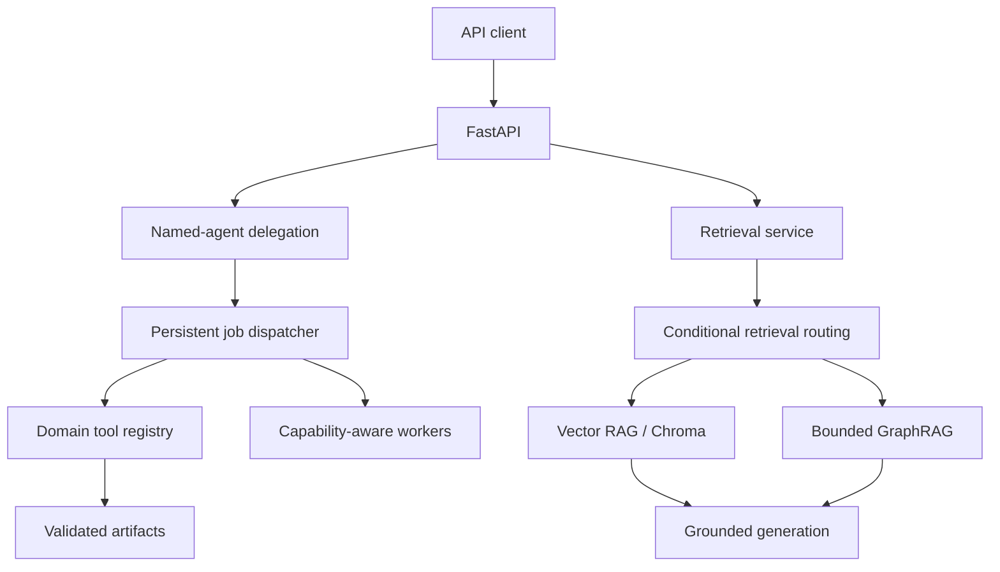

# Personal GraphRAG Scientific Computing Agent

[](https://github.com/syedkhadeermo/personal-graphrag-agent/actions/workflows/ci.yml)
[](LICENSE)

A local-first agentic scientific-computing platform that combines Vector RAG, GraphRAG, named-agent delegation, persistent asynchronous jobs, capability-aware remote workers, and local or remote scientific tools.

The project explores a practical engineering question: **when does graph-enhanced retrieval add enough value to justify its additional context and latency?** An independent public-document pilot benchmark found that Vector RAG performed better on direct questions, while graph augmentation showed selective benefit on relationship-oriented boundary questions. The system therefore supports conditional routing between Vector RAG and GraphRAG rather than assuming graph retrieval is always better.

The same orchestration layer executes workloads across three domains:

- Drug discovery: RDKit, ADMET-AI, AutoDock Vina, Smina and GROMACS
- CAD and simulation: FreeCAD, OpenFOAM and Blender
- Defensive cybersecurity: bounded, explicitly authorized TCP discovery aligned with NIST SP 800-115


## What this project demonstrates

- Metadata-filtered RAG over technical documents stored in ChromaDB
- Persistent scientific relationships with focused multi-hop graph traversal
- Retrieval-seeded GraphRAG that excludes unrelated graph branches
- Named-agent routing with domain and tool authorization
- Persistent jobs backed by SQLite
- Asynchronous dispatch, retries, recovery and atomic job claiming
- Worker capability registration and health-aware workload routing
- SHA-256 artifact validation and manifest registration
- Local Windows, WSL and remote Windows/WSL execution adapters
- Provider-neutral generation through Ollama, OpenAI, Anthropic or Gemini
- FastAPI discovery, submission and job-status endpoints
- Dockerized local execution for portable tools such as RDKit
- Verified AWS deployment with Terraform, EC2, Session Manager, scoped IAM and private S3 artifacts ([details](infra/terraform/README.md))
- Defensive scope validation for the optional cybersecurity domain
- Independent Vector RAG vs GraphRAG evaluation with conditional retrieval routing

## Architecture



## Verified workflows

### Drug discovery

The drug-discovery layer supports:

- RDKit molecular descriptors, canonical SMILES, molecular formula, Lipinski rules and Veber rules
- ADMET-AI v2 predictions grouped into absorption, distribution, metabolism, excretion, toxicity, physicochemical properties and structural alerts
- AutoDock Vina and Smina docking adapters
- GROMACS molecular-dynamics execution
- A curated graph connecting candidate screening, docking poses, protein-ligand complexes and dynamic-stability analysis

Verified execution paths include direct tool use, registry execution, asynchronous persistent jobs, named-agent delegation and API submission.

ADMET and toxicity values are computational estimates, not experimental or clinical conclusions.

### CAD and engineering simulation

The portfolio demonstration executes a coherent workflow on a remote compute worker:

1. FreeCAD creates a 200 × 50 × 20 mm rectangular flow domain.
2. OpenFOAM 12 generates and validates a 1,600-cell hexahedral mesh.
3. A laminar simulation advances to 1 second of simulated time.
4. Blender 5.0.1 produces a 96-frame visualization.

Observed demonstration values:

| Metric | Result |
|---|---:|
| Mesh cells | 1,600 |
| Maximum mesh non-orthogonality | 0 |
| Maximum Courant number | approximately 0.551 |
| Mean final velocity magnitude | approximately 1.000 m/s |
| Maximum final velocity magnitude | approximately 1.100 m/s |

The demo source is under `demos/cad_flow_channel/`. Generated frames, native CAD files and runtime results are intentionally excluded from Git.

### Defensive cybersecurity

The cybersecurity domain demonstrates bounded defensive automation rather than penetration testing. It:

- Requires explicit authorization
- Accepts one private or loopback IP address
- Requires an explicit list of no more than 32 ports
- Rejects public IPs, hostnames and network ranges
- Performs TCP connection checks only
- Produces informational findings and limitations
- Records NIST SP 800-115 discovery-phase methodology metadata

It performs no exploitation, authentication attempts, banner collection, password testing or unrestricted scanning.

## Independent Vector RAG vs GraphRAG pilot

The repository includes a small independent benchmark using public documents, real Chroma retrieval and gold claims maintained separately from the curated knowledge graph. The purpose is to measure retrieval strategies rather than construct an evaluation that assumes GraphRAG should win.

Latest representative run:

| Metric | Vector RAG | GraphRAG |
|---|---:|---:|
| Claim coverage | **0.667** | 0.639 |
| Average prompt tokens | **2,580** | 2,768 |
| Average answer tokens | **178** | 208 |
| Average generation latency | **23.1 s** | 28.0 s |

Retrieval source recall: **0.778**

Claim coverage by question category:

| Category | Questions | Vector RAG | GraphRAG |
|---|---:|---:|---:|
| Direct | 3 | **1.000** | 0.889 |
| Cross-source | 2 | 0.500 | 0.500 |
| Boundary | 1 | 0.000 | **0.167** |

This small pilot does **not** demonstrate a universal GraphRAG advantage. Vector retrieval was stronger and cheaper for direct questions, while graph augmentation showed selective benefit on the boundary question. These results motivated conditional routing: direct questions stay on Vector RAG, while relationship-oriented questions can add bounded graph context.

The benchmark is intentionally small and should be treated as an engineering pilot rather than a general statistical claim about GraphRAG.

## GraphRAG behavior

Questions use conservative conditional retrieval. Direct documentation questions
use Vector RAG, while workflow, relationship, and scientific-boundary questions
can add bounded graph context. Callers may explicitly select `auto`, `vector`, or
`graph`; every response records the requested mode, selected mode, confidence,
routing signals, and recognized question entities.

When graph retrieval is selected, retrieval results seed relevant graph nodes
before traversal. This keeps graph context focused. For example:

- An ADMET question traverses ADMET-AI, Chemprop, DILI, hERG, toxicity and cardiotoxicity relationships.
- A docking workflow question traverses molecular docking, docking pose, protein-ligand complex, molecular dynamics, GROMACS, RMSD and RMSF relationships.
- CAD questions remain within FreeCAD, OpenFOAM and Blender branches.
- Defensive-security questions remain within authorization, discovery, findings and remediation branches.

Metadata filters support domain, subdomain, tool, version, visibility, document type and source.

## API

The FastAPI service exposes health, capability discovery, named agents and persistent job operations.

Typical flow:

```text
POST /jobs
→ named-agent delegation
→ SQLite-backed queue
→ asynchronous dispatcher
→ domain tool
→ persisted structured result
→ GET /jobs/{job_id}
```

Start locally:

```bash
export GRAPH_RAG_API_KEY="replace-with-a-long-random-value"
uvicorn app.api.main:app --host 0.0.0.0 --port 8000
```

Job endpoints accept the key in the `X-API-Key` header. Health and capability
discovery remain public. If `GRAPH_RAG_API_KEY` is unset, authentication is
disabled for local/personal development. CORS defaults to local UI origins;
set `GRAPH_RAG_CORS_ORIGINS` to a comma-separated allowlist when needed.

Useful endpoints:

- `GET /health`
- `GET /runtime`
- `GET /capabilities`
- `GET /agents`
- `POST /jobs`
- `GET /jobs/{job_id}`

## Docker

Build and start the API:

```bash
docker compose build
docker compose up -d
```

Verify it:

```bash
curl http://localhost:8000/health
curl http://localhost:8000/capabilities
```

The verified Docker image runs RDKit locally inside the container. Remote CAD and WSL workloads require an appropriately configured worker and are not expected to run inside the base container.

## Local development

Requirements:

- Python 3.12
- Ollama for local embeddings and generation
- ChromaDB
- Optional WSL scientific environments for RDKit, ADMET-AI and GROMACS
- Optional SSH-accessible worker for FreeCAD, OpenFOAM and Blender

### Generation providers

Ollama remains the default and requires no cloud credentials:

```bash
export GENERATION_PROVIDER="ollama"
export OLLAMA_GENERATION_MODEL="deepseek-coder:6.7b"
```

To use a cloud model for grounded answer generation, select one provider and
set its API key and model name:

```bash
# OpenAI
export GENERATION_PROVIDER="openai"
export OPENAI_API_KEY="..."
export OPENAI_MODEL="your-openai-model"

# Anthropic ("claude" is also accepted as the provider name)
export GENERATION_PROVIDER="anthropic"
export ANTHROPIC_API_KEY="..."
export ANTHROPIC_MODEL="your-anthropic-model"

# Google Gemini ("google" is also accepted as the provider name)
export GENERATION_PROVIDER="gemini"
export GEMINI_API_KEY="..."
export GEMINI_MODEL="your-gemini-model"
```

`GENERATION_MODEL` can replace the provider-specific model variable. API keys
are read only from the environment and must not be committed. This abstraction
changes grounded text generation only; ingestion and retrieval still use the
local Ollama embedding model, so existing Chroma collections remain compatible.

Windows setup:

```cmd
python -m venv .venv
.venv\Scripts\activate
python -m pip install -r requirements.txt
```

Install the optional ADMET-AI/PyTorch execution stack only where that workload
will run:

```cmd
python -m pip install -r requirements-sci.txt
```

For development and CI tooling:

```cmd
python -m pip install -r requirements-dev.txt
```

Run the test suite:

```cmd
python -m pytest -q
```

This collects the complete suite and runs portable tests, while clearly
reporting environment-dependent tests as skipped. Run tests that require local
Ollama models, private knowledge files, WSL scientific environments, or the SSH
Mini-PC only from a configured workstation:

```cmd
python -m pytest -q --run-external
```

Script-style integration tests can still be executed directly with `runpy`,
which keeps their printed verification reports visible.

## Knowledge and privacy

The public repository intentionally excludes:

- Private PDFs and research documents
- Chroma vector databases
- SQLite job databases
- Model weights and scientific datasets
- Credentials and environment files
- Native CAD and simulation outputs
- Generated animation-frame sequences
- Machine-specific inspection snapshots

Only small, non-sensitive public examples and reproducible source code are included. Knowledge ingestion uses SHA-256 document identity, duplicate prevention and resumable chunk indexing.

## Repository layout

```text
app/
  agent/              named agents, jobs, tools and workers
  api/                FastAPI application and runtime
  graphrag/           retrieval-guided graph orchestration
  knowledge/          document loading and ingestion
  knowledge_graph/    graph persistence, building and traversal
  retrieval/          metadata-filtered semantic retrieval
  vectorstore/        ChromaDB adapter
demos/
  cad_flow_channel/   FreeCAD, OpenFOAM and Blender demonstration
evaluation/
  public_graphrag/    independent Vector RAG vs GraphRAG pilot
infra/
  terraform/          verified AWS deployment and lifecycle documentation
scripts/              maintenance and privacy-audit utilities
tests/                isolated unit and integration tests
```

## Verified AWS deployment

The [Terraform implementation](infra/terraform/README.md) provisions a bounded AWS environment with a VPC, an IP-restricted EC2 API, Systems Manager administration, scoped IAM and private S3 artifact storage.

A complete deployment cycle in `eu-north-1` created 17 resources; verified `/health`, `/capabilities`, Systems Manager connectivity and S3 synchronization; confirmed zero Terraform drift; and then destroyed every resource, leaving an empty state.

## Scope

This repository is an engineering portfolio and research-orchestration demonstration. It is not a clinical decision system, validated scientific instrument, or offensive-security toolkit. Users are responsible for validating scientific results and obtaining authorization before assessing any system.

## Project status

The portfolio implementation is feature-complete for its current scope. The repository includes conditional Vector/GraphRAG retrieval, provider-neutral grounded generation, named-agent delegation, persistent asynchronous jobs, capability- and health-aware worker routing, FastAPI and Docker interfaces, validated artifact handling, and verified local/remote scientific workflows.

The public pilot benchmark, automated test suite and verified Terraform lifecycle provide reproducible evaluation, regression and infrastructure evidence. Future work is intentionally limited to larger evaluation sets, additional reproducible scientific case studies, remote Terraform state with native locking, and production hardening rather than expansion of the core orchestration architecture.
