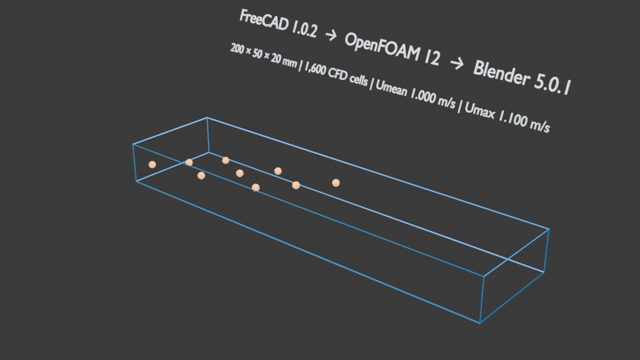
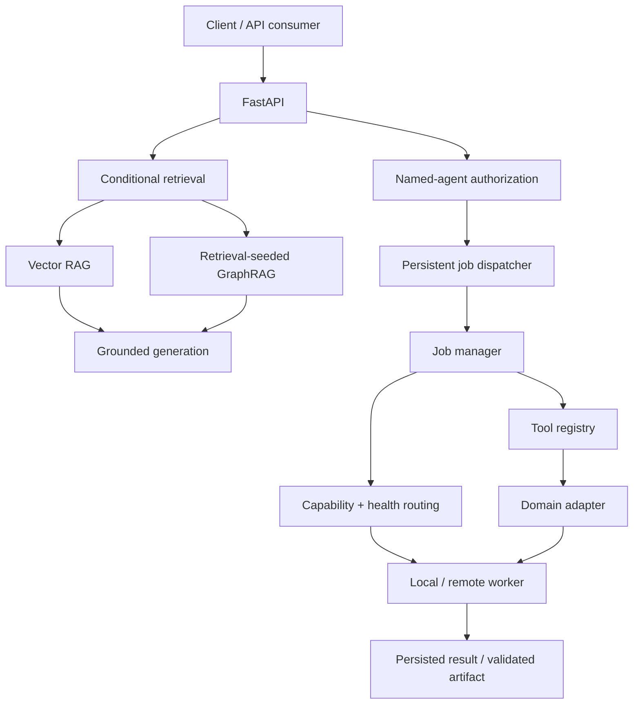
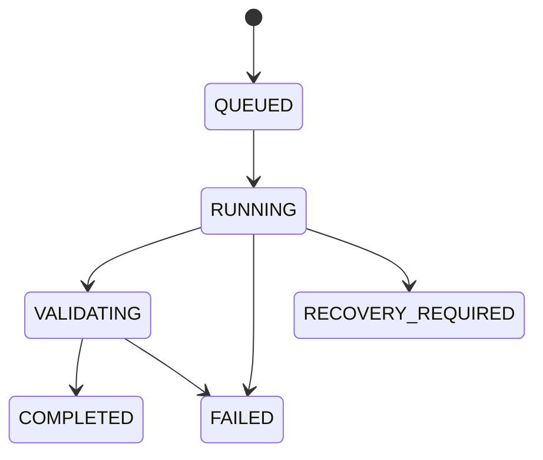

# Agentic GraphRAG for Scientific & Engineering Computing

[](https://github.com/syedkhadeermo/personal-graphrag-agent/actions/workflows/ci.yml)
[](https://www.python.org/)
[](https://fastapi.tiangolo.com/)
[](LICENSE)

An execution-oriented AI platform that combines **conditional Vector RAG/GraphRAG**, **named-agent authorization**, **durable asynchronous jobs**, and **capability-aware routing** to local or remote scientific-compute workers.

The project answers two practical engineering questions:

1. When does graph context add enough value to justify its extra tokens and latency?
2. Can one orchestration architecture support substantially different computational domains without embedding domain logic in its core?

The current implementation spans drug discovery, CAD/CFD, structural FEA, and bounded defensive-security workflows.



## Why this project is different

This is not a chat wrapper around a vector database. It separates retrieval, authorization, durable execution, worker selection, domain adapters, and artifact handling.

| Engineering concern | Implemented approach |
|---|---|
| Retrieval strategy | Conditional routing between Vector RAG and retrieval-seeded, bounded GraphRAG |
| Agent authorization | Named agents with explicit `domain:tool` routes |
| Long-running work | SQLite-backed jobs with atomic claiming, retries, events, and restart recovery |
| Heterogeneous compute | Capability- and health-aware selection of local or remote workers |
| Domain extensibility | Tool adapters for chemistry, docking, MD, CAD, CFD, FEA, and defensive discovery |
| Evidence | Portable CI, a public GraphRAG benchmark, reproducible demos, and a verified Terraform lifecycle |
| Safety | API-key protection, localhost-bound Docker exposure, remote-execution policy, and bounded security tooling |

### Verified snapshot

| Evidence | Result |
|---|---:|
| Portable CI suite | **80 passed, 15 skipped** |
| Ruff | **All checks passed** |
| Public GraphRAG benchmark | Vector RAG stronger on direct questions; selective graph benefit on a boundary question |
| CAD/CFD demo | FreeCAD → OpenFOAM → Blender workflow completed |
| Structural FEA | CalculiX asynchronous execution path completed with return code 0 |
| AWS portfolio deployment | 17 resources created, verified, drift-checked, and destroyed |

These results demonstrate engineering behavior, not universal GraphRAG superiority or experimental scientific validation. See [Verified workflows](docs/verified-workflows.md) for scope and limitations.

## Quick start

The fastest portable demonstration uses Docker and the RDKit workflow included in the base image.

### Windows PowerShell

```powershell
git clone https://github.com/syedkhadeermo/personal-graphrag-agent.git
Set-Location personal-graphrag-agent
Copy-Item .env.example .env
docker compose up --build -d

Invoke-RestMethod http://127.0.0.1:8000/health
Invoke-RestMethod http://127.0.0.1:8000/capabilities
```

Change the example `GRAPH_RAG_API_KEY` in `.env` before exposing or sharing the service.

### Linux or macOS

The Compose file mounts the current user's SSH directory for optional remote workers. Map `USERPROFILE` to the home directory before starting it:

```bash
git clone https://github.com/syedkhadeermo/personal-graphrag-agent.git
cd personal-graphrag-agent
cp .env.example .env
export USERPROFILE="$HOME"
docker compose up --build -d

curl http://127.0.0.1:8000/health
curl http://127.0.0.1:8000/capabilities
```

The API documentation is available at [http://127.0.0.1:8000/docs](http://127.0.0.1:8000/docs).

## Run a complete portable job

Submit an RDKit descriptor job using the API key stored in `.env`:

```bash
curl -X POST http://127.0.0.1:8000/jobs \
  -H "Content-Type: application/json" \
  -H "X-API-Key: replace-with-a-long-random-secret" \
  -d '{
    "domain": "drug_discovery",
    "tool": "rdkit_descriptors",
    "request": {
      "smiles": "CC(=O)Oc1ccccc1C(=O)O",
      "timeout": 60
    },
    "max_attempts": 1
  }'
```

The API returns `202 Accepted` with a durable job ID:

```json
{
  "job_id": "<job-id>",
  "agent_id": "drug-discovery-agent",
  "domain": "drug_discovery",
  "tool": "rdkit_descriptors",
  "status": "submitted"
}
```

Poll the persisted result:

```bash
curl \
  -H "X-API-Key: replace-with-a-long-random-secret" \
  http://127.0.0.1:8000/jobs/<job-id>
```

## Architecture



The generic orchestration layers do not contain FreeCAD-, GROMACS-, or CalculiX-specific routing algorithms. A new compute mechanism is added through capability declaration, a domain adapter, tool registration, agent authorization, and runtime composition.

See [Architecture](docs/architecture.md) for component responsibilities and request lifecycles.

## Supported capabilities

| Domain | Tools | Execution profile |
|---|---|---|
| Drug discovery | RDKit, ADMET-AI, AutoDock Vina, Smina, GROMACS | Portable RDKit; optional local/remote scientific stack |
| CAD and CFD | FreeCAD, OpenFOAM, Blender | Remote or machine-specific worker |
| Structural FEA | CalculiX | Remote worker |
| Defensive security | Authorized private/loopback TCP discovery | Portable, explicitly bounded |

Registered tool routes include:

```text
drug_discovery:rdkit_descriptors
drug_discovery:admet_prediction
drug_discovery:vina_docking
drug_discovery:smina_docking
drug_discovery:gromacs_md
cad_simulation:freecad
cad_simulation:openfoam
cad_simulation:blender
structural_fea:calculix
cybersecurity:vulnerability_scan
```

## Conditional Vector RAG / GraphRAG

Callers may request `auto`, `vector`, or `graph` retrieval. In automatic mode, direct document questions normally stay on the vector path; relationship, workflow, or boundary questions may receive bounded graph context.

Graph traversal is seeded from entities found in vector-retrieved evidence. This reduces unrelated graph expansion and keeps the graph branch tied to retrieved documents.

Every response records:

- Requested and selected retrieval modes
- Routing confidence and signals
- Recognized question entities
- Retrieved evidence and graph context where applicable

### Public benchmark

The repository contains a small independent benchmark built from public RDKit, AutoDock Vina, and GROMACS documentation. Gold claims are maintained separately from the curated graph.

| Metric | Vector RAG | GraphRAG |
|---|---:|---:|
| Claim coverage | **0.667** | 0.639 |
| Average prompt tokens | **2,580** | 2,768 |
| Average answer tokens | **178** | 208 |
| Average generation latency | **23.1 s** | 28.0 s |

| Question category | Questions | Vector RAG | GraphRAG |
|---|---:|---:|---:|
| Direct | 3 | **1.000** | 0.889 |
| Cross-source | 2 | 0.500 | 0.500 |
| Boundary | 1 | 0.000 | **0.167** |

The result does not establish a universal GraphRAG advantage. It motivated the conditional router: vector retrieval is usually cheaper for direct questions, while bounded graph augmentation may add relationship evidence for selected questions.

See the [benchmark methodology](evaluation/public_graphrag/README.md) for reproducibility and interpretation limits.

## Durable agentic execution

A computational request does not directly invoke an executable:

1. A named agent authorizes the requested domain and tool.
2. The dispatcher persists and queues the job.
3. The manager resolves required worker capabilities.
4. Worker health and compatibility determine placement.
5. The tool registry invokes the domain adapter.
6. Results, events, attempts, errors, and supported artifacts are persisted.

Job states include:



The recovery policy is deliberately conservative because silently duplicating an expensive scientific job can be worse than requiring operator review.

## API

| Method | Endpoint | Purpose | Authentication |
|---|---|---|---|
| `GET` | `/health` | Service and dispatcher health | Public |
| `GET` | `/runtime` | Runtime, queue, tool, and agent status | Public |
| `GET` | `/capabilities` | Registered domains and tools | Public |
| `GET` | `/agents` | Named-agent discovery | Public |
| `POST` | `/jobs` | Validate and submit a durable job | API key when configured |
| `GET` | `/jobs/{job_id}` | Read persisted job state | API key when configured |

Job endpoints accept the key in the `X-API-Key` header. If `GRAPH_RAG_API_KEY` is unset, authentication is disabled for local development. Never expose an unauthenticated instance to an untrusted network.

## Remote scientific-compute workers

Remote workers are configured through environment variables rather than repository-specific host addresses:

```bash
export GRAPH_RAG_REMOTE_HOST="your-worker-host"
export GRAPH_RAG_REMOTE_USERNAME="your-worker-user"
export GRAPH_RAG_REMOTE_WORKER_ID="remote-compute"
export GRAPH_RAG_REMOTE_HOSTNAME="optional-hostname"
```

Additional allowlists constrain job roots, artifact roots, OpenFOAM case roots, and approved solver names. If remote configuration is absent, the API starts without registering a remote compute worker.

Read [Security model](docs/security-model.md) before enabling remote execution.

## Generation providers

Grounded text generation supports:

- Ollama
- OpenAI
- Anthropic
- Google Gemini

Ollama is the default local provider:

```bash
export GENERATION_PROVIDER="ollama"
export OLLAMA_GENERATION_MODEL="deepseek-coder:6.7b"
```

Cloud credentials are read from environment variables and must never be committed. Generation-provider selection does not change the embedding model used by existing Chroma collections.

## Local development and CI

Python 3.12 is the supported development version.

```bash
python -m venv .venv

# Linux / macOS
source .venv/bin/activate

# Windows PowerShell
# .venv\Scripts\Activate.ps1

python -m pip install --upgrade pip
python -m pip install -r requirements-dev.txt
python -m ruff check app tests
python -m pytest -q
```

Tests marked `external` require local models, private data, WSL, or an SSH-accessible worker and are skipped by the portable CI environment.

Optional scientific dependencies are listed in `requirements-sci.txt`.

## AWS deployment

The Terraform configuration provisions a deliberately small portfolio deployment:

- Amazon Linux EC2 running the containerized API
- No inbound SSH; administration through Systems Manager
- An encrypted, versioned S3 bucket scoped to runtime artifacts
- Network access restricted to a configured workstation `/32`
- Explicit validation, drift-check, and destruction workflow

See [AWS Terraform deployment](infra/terraform/README.md). Scientific applications remain on local or remote workers; the EC2 deployment hosts the orchestration API rather than GPU or solver workloads.

## Repository map

```text
app/
  agent/             named agents, durable jobs, tools, workers, artifacts
  api/               FastAPI application, schemas, runtime composition
  graphrag/          graph construction and bounded traversal
  ingestion/         document ingestion and metadata handling
  rag/               retrieval, routing, embeddings, generation providers
demos/
  cad_flow_channel/  reproducible FreeCAD/OpenFOAM/Blender demonstration
evaluation/
  public_graphrag/   public-document Vector RAG vs GraphRAG benchmark
infra/
  terraform/         verified AWS portfolio deployment
docs/                architecture, security, and workflow evidence
scripts/             privacy audit and metadata maintenance utilities
tests/               portable and externally marked tests
```

## Security and responsible use

- Read [SECURITY.md](SECURITY.md) before reporting a vulnerability.
- Review the [security model](docs/security-model.md) before configuring SSH workers.
- The defensive-security tool accepts only explicit private or loopback IP addresses and at most 32 explicitly listed ports.
- It performs TCP connection checks only: no exploitation, authentication attempts, password testing, banner collection, hostnames, public IPs, or network ranges.
- ADMET and toxicity outputs are computational predictions, not experimental or clinical conclusions.
- Successful solver execution is not equivalent to numerical-model validation.

## Scope and limitations

- The public GraphRAG evaluation is an engineering pilot, not a statistically general benchmark.
- Optional scientific tools require their own validated installations and domain-appropriate input preparation.
- Artifact validation is workflow-dependent. Current CalculiX output files are not yet registered through the generic artifact manifest.
- SQLite is appropriate for this single-service portfolio architecture; distributed production deployments would require a different queue and persistence design.
- The project does not claim clinical, experimental, regulatory, or high-fidelity engineering validation.

## Documentation

- [Architecture](docs/architecture.md)
- [Security model](docs/security-model.md)
- [Verified workflows](docs/verified-workflows.md)
- [Public GraphRAG benchmark](evaluation/public_graphrag/README.md)
- [AWS Terraform deployment](infra/terraform/README.md)
- [Contributing](CONTRIBUTING.md)

## Contributing

Issues and focused pull requests are welcome. Run the portable test and lint suites before submitting changes. See [CONTRIBUTING.md](CONTRIBUTING.md) for the development workflow and review checklist.

## License

Released under the [MIT License](LICENSE).
