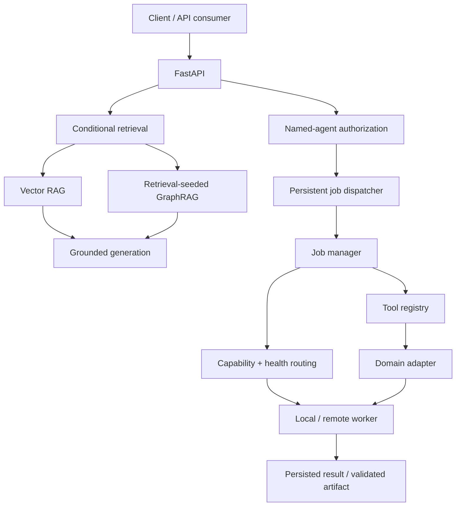
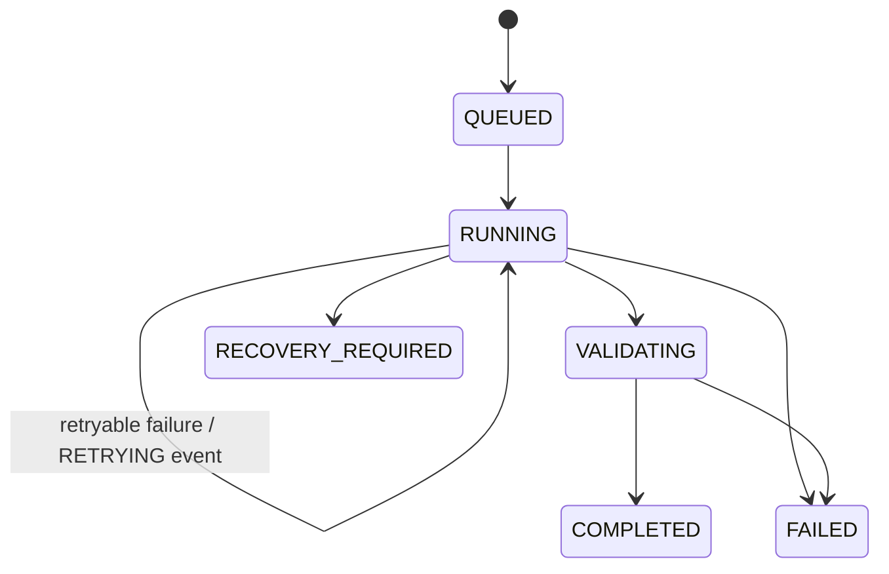

# Personal GraphRAG Agent

[](https://github.com/syedkhadeermo/personal-graphrag-agent/actions/workflows/ci.yml)
[](https://www.python.org/)
[](https://fastapi.tiangolo.com/)
[](LICENSE)

Personal GraphRAG Agent is a Python platform for answering technical questions and running long scientific-computing jobs. It chooses simple vector retrieval for direct questions and bounded graph traversal when relationships or workflow context matter. The same orchestration layer can dispatch chemistry, CAD/CFD, structural-analysis, and defensive-security tools to local or remote workers.


## 60-second local demo

Docker is the shortest path to a running API. It requires an explicit API key and exposes the service only on `127.0.0.1`.

```bash
git clone https://github.com/syedkhadeermo/personal-graphrag-agent.git
cd personal-graphrag-agent
export GRAPH_RAG_API_KEY="$(openssl rand -hex 32)"
docker compose up --build -d
curl http://127.0.0.1:8000/health
curl -H "X-API-Key: $GRAPH_RAG_API_KEY" \
  http://127.0.0.1:8000/capabilities
```

In PowerShell, generate a key with Python, then start Compose and call the protected endpoint:

```powershell
$env:GRAPH_RAG_API_KEY = python -c "import secrets; print(secrets.token_hex(32))"
docker compose up --build -d
Invoke-RestMethod http://127.0.0.1:8000/capabilities `
  -Headers @{"X-API-Key"=$env:GRAPH_RAG_API_KEY}
```

The application rejects the placeholder value formerly shown in `.env.example`. Save the generated key securely if you want to reuse it after closing the shell. Interactive API documentation is available at [http://127.0.0.1:8000/docs](http://127.0.0.1:8000/docs).

## Design goals

This is not a chat wrapper around a vector database. It separates retrieval, authorization, durable execution, worker selection, domain adapters, and artifact handling.

| Engineering concern | Implemented approach |
|---|---|
| Retrieval strategy | Conditional routing between Vector RAG and retrieval-seeded, bounded GraphRAG |
| Agent authorization | Named agents with explicit `domain:tool` routes |
| Long-running work | SQLite-backed jobs with atomic claiming, retries, events, and restart recovery |
| Heterogeneous compute | Capability- and health-aware selection of local or remote workers |
| Domain extensibility | Tool adapters for chemistry, docking, MD, CAD, CFD, FEA, and defensive discovery |
| Evidence | Portable CI, a public GraphRAG benchmark, reproducible demos, and a verified Terraform lifecycle |
| Safety | API-key protection, localhost-bound Docker exposure, remote-execution policy, and bounded security tooling |

### Verified snapshot

| Evidence | Result |
|---|---:|
| Portable CI suite | **91 passed, 15 skipped** |
| Ruff | **All checks passed** |
| Deterministic router benchmark | **32/32 expected routes (100%)**; vector 17/17, graph 15/15 |
| Expanded Vector RAG vs GraphRAG run | Pending a complete, manually reviewed run with the documented general model |
| CAD/CFD demo | FreeCAD → OpenFOAM → Blender workflow completed |
| Structural FEA | CalculiX asynchronous execution path completed with return code 0 |
| AWS portfolio deployment | 17 resources created, verified, drift-checked, and destroyed |

These results demonstrate engineering behavior, not universal GraphRAG superiority or experimental scientific validation. See [Verified workflows](docs/verified-workflows.md) for scope and limitations.

## Run a complete portable job

Submit an RDKit descriptor job using the generated API key. Replace the marked
value with a public, nonconfidential test structure; never paste an unpublished
candidate into a demo or issue:

```bash
curl -X POST http://127.0.0.1:8000/jobs \
  -H "Content-Type: application/json" \
  -H "X-API-Key: $GRAPH_RAG_API_KEY" \
  -d '{
    "domain": "drug_discovery",
    "tool": "rdkit_descriptors",
    "request": {
      "smiles": "<PUBLIC_NONCONFIDENTIAL_SMILES>",
      "timeout": 60
    },
    "max_attempts": 1
  }'
```

The API returns `202 Accepted` with a durable job ID:

```json
{
  "job_id": "<job-id>",
  "agent_id": "drug-discovery-agent",
  "domain": "drug_discovery",
  "tool": "rdkit_descriptors",
  "status": "submitted"
}
```

Poll the persisted result:

```bash
curl \
  -H "X-API-Key: $GRAPH_RAG_API_KEY" \
  http://127.0.0.1:8000/jobs/<job-id>
```

## Architecture



The generic orchestration layers do not contain FreeCAD-, GROMACS-, or CalculiX-specific routing algorithms. A new compute mechanism is added through capability declaration, a domain adapter, tool registration, agent authorization, and runtime composition.

See [Architecture](docs/architecture.md) for component responsibilities and request lifecycles.

### Read the core implementation

The main engineering paths are directly browsable without cloning the repository:

| Concern | Source |
|---|---|
| Named-agent authorization | [`app/agent/named_agent_registry.py`](app/agent/named_agent_registry.py) |
| Durable asynchronous dispatch | [`app/agent/jobs/job_dispatcher.py`](app/agent/jobs/job_dispatcher.py) |
| Capability-aware worker routing | [`app/agent/workers/workload_router.py`](app/agent/workers/workload_router.py) |
| Conditional retrieval decision | [`app/graphrag/retrieval_router.py`](app/graphrag/retrieval_router.py) |
| GraphRAG orchestration | [`app/graphrag/graphrag_service.py`](app/graphrag/graphrag_service.py) |
| Persistent bounded graph traversal | [`app/knowledge_graph/graph_store.py`](app/knowledge_graph/graph_store.py) |
| Remote-execution policy | [`app/agent/workers/remote_execution_policy.py`](app/agent/workers/remote_execution_policy.py) |
| API composition and job endpoints | [`app/api/main.py`](app/api/main.py) |

## Supported capabilities

| Domain | Tools | Execution profile |
|---|---|---|
| Drug discovery | RDKit, ADMET-AI, AutoDock Vina, Smina, GROMACS | Bundled RDKit; optional ADMET Python stack; external docking/MD executables |
| CAD and CFD | FreeCAD, OpenFOAM, Blender | External applications on a machine-specific worker |
| Structural FEA | CalculiX | External application on a remote worker |
| Defensive security | Authorized private/loopback TCP discovery | Portable, explicitly bounded |

Registered tool routes include:

```text
drug_discovery:rdkit_descriptors
drug_discovery:admet_prediction
drug_discovery:vina_docking
drug_discovery:smina_docking
drug_discovery:gromacs_md
cad_simulation:freecad
cad_simulation:openfoam
cad_simulation:blender
structural_fea:calculix
cybersecurity:vulnerability_scan
```

### Installation profiles

Supported adapters do not imply that every scientific application is bundled into the core Python environment.

| Profile | Install or provide | Purpose |
|---|---|---|
| Core/API | `python -m pip install -r requirements.txt` | FastAPI, retrieval, local generation, document ingestion, and portable RDKit execution |
| Development/CI | `python -m pip install -r requirements-dev.txt` | Core plus pytest and Ruff |
| ADMET | `python -m pip install -r requirements-sci.txt` | Core plus pinned PyTorch and ADMET-AI |
| Remote execution | System OpenSSH client | Used through `subprocess`; Paramiko is not required |
| Docking/MD/CAD/CFD/FEA | Tool executable on the selected worker | Vina, Smina, GROMACS, FreeCAD, OpenFOAM, Blender, or CalculiX |

The graph store is implemented in the repository and does not require NetworkX. Cloud generation uses Python's standard-library HTTP client and does not directly require `aiohttp` or provider SDKs. See [Dependency and runtime profiles](docs/dependencies.md) for the complete boundary.

## Conditional Vector RAG / GraphRAG

Callers may request `auto`, `vector`, or `graph` retrieval. In automatic mode, direct document questions normally stay on the vector path; relationship, workflow, or boundary questions may receive bounded graph context.

Graph traversal is seeded from entities found in vector-retrieved evidence. This reduces unrelated graph expansion and keeps the graph branch tied to retrieved documents.

Every response records:

- Requested and selected retrieval modes
- Routing confidence and signals
- Recognized question entities
- Retrieved evidence and graph context where applicable

### Public benchmark

The repository includes a 32-question benchmark built only from public RDKit, AutoDock Vina, and GROMACS documentation. It contains 17 direct, 10 cross-source, and 5 boundary questions. Every question has an expected retrieval route, independently maintained gold sources, and claim-level checks.

The runner reports router accuracy and a confusion matrix, retrieval source recall, claim coverage, token use, latency, and population standard deviation across repeated runs. Vector and GraphRAG generation order alternates to reduce ordering bias. Long runs checkpoint after every completed question and can resume with validated model, corpus, and protocol settings; optional generation and between-question cooldowns support thermally constrained local hardware.

The deterministic router has been executed against all 32 expected-route labels: **32/32 correct (100%)**. Its confusion matrix is 17 vector questions routed to vector, 15 graph questions routed to graph, and zero cross-route errors. The [machine-readable router result](evaluation/public_graphrag/published/router_results.json) records every decision and the SHA-256 identity of the gold-question file. These labels belong to the public development suite rather than an independently held-out set, so this result verifies the present routing rules; it is not a generalization claim.

The previously published six-question run is retained in [Verified workflows](docs/verified-workflows.md) as a clearly labelled historical pilot, not as evidence for a general performance claim. The expanded suite must be run and manually reviewed before new model-comparison numbers are published.

See the [benchmark methodology](evaluation/public_graphrag/README.md) for reproducibility and interpretation limits.

## Durable agentic execution

A computational request does not directly invoke an executable:

1. A named agent authorizes the requested domain and tool.
2. The dispatcher persists and queues the job.
3. The manager resolves required worker capabilities.
4. Worker health and compatibility determine placement.
5. The tool registry invokes the domain adapter.
6. Results, events, attempts, errors, and supported artifacts are persisted.

Job states include:



The recovery policy is deliberately conservative because silently duplicating an expensive scientific job can be worse than requiring operator review.

## API

| Method | Endpoint | Purpose | Authentication |
|---|---|---|---|
| `GET` | `/health` | Service and dispatcher health | Public |
| `GET` | `/runtime` | Runtime, queue, tool, and agent status | API key |
| `GET` | `/capabilities` | Registered domains and tools | API key |
| `GET` | `/agents` | Named-agent discovery | API key |
| `POST` | `/jobs` | Validate and submit a durable job | API key |
| `GET` | `/jobs/{job_id}` | Read persisted job state | API key |

Protected endpoints accept the key in the `X-API-Key` header. Startup fails when `GRAPH_RAG_API_KEY` is unset. A loopback-only developer may explicitly opt out with `GRAPH_RAG_ALLOW_INSECURE_LOCAL=true`; never use that setting on a shared or remotely reachable service.

## Remote scientific-compute workers

Remote workers are configured through environment variables rather than repository-specific host addresses:

```bash
export GRAPH_RAG_REMOTE_HOST="your-worker-host"
export GRAPH_RAG_REMOTE_USERNAME="your-worker-user"
export GRAPH_RAG_REMOTE_WORKER_ID="remote-compute"
export GRAPH_RAG_REMOTE_HOSTNAME="optional-hostname"
```

Additional allowlists constrain job roots, artifact roots, OpenFOAM case roots, and approved solver names. If remote configuration is absent, the API starts without registering a remote compute worker.

The base Compose configuration does not mount SSH material. To enable a remote worker, point `GRAPH_RAG_SSH_DIR` at a dedicated least-privilege SSH directory and apply the opt-in override:

```bash
GRAPH_RAG_SSH_DIR=/path/to/dedicated-ssh \
docker compose -f compose.yaml -f compose.remote.yaml up --build -d
```

Read [Security model](docs/security-model.md) before enabling remote execution.

## Generation providers

Grounded text generation supports:

- Ollama
- OpenAI
- Anthropic
- Google Gemini

Ollama is the default local provider:

```bash
export GENERATION_PROVIDER="ollama"
export OLLAMA_GENERATION_MODEL="qwen3:8b"
```

Cloud credentials are read from environment variables and must never be committed. Generation-provider selection does not change the embedding model used by existing Chroma collections.

## Local development and CI

Python 3.12 is the supported development version.

```bash
python -m venv .venv

# Linux / macOS
source .venv/bin/activate

# Windows PowerShell
# .venv\Scripts\Activate.ps1

python -m pip install --upgrade pip
python -m pip install -r requirements-dev.txt
python -m ruff check app tests evaluation
python -m pytest -q
```

Tests marked `external` require local models, private data, WSL, or an SSH-accessible worker and are skipped by the portable CI environment.

Optional scientific dependencies are listed in `requirements-sci.txt`.

## AWS deployment

The Terraform configuration provisions a deliberately small portfolio deployment:

- Amazon Linux EC2 running the containerized API
- No inbound SSH; administration through Systems Manager
- An encrypted, versioned S3 bucket scoped to runtime artifacts
- Network access restricted to a configured workstation `/32`
- Explicit validation, drift-check, and destruction workflow

See [AWS Terraform deployment](infra/terraform/README.md). Scientific applications remain on local or remote workers; the EC2 deployment hosts the orchestration API rather than GPU or solver workloads.

## Repository map

```text
app/
  agent/             named agents, durable jobs, tools, workers, artifacts
  api/               FastAPI application, schemas, runtime composition
  graphrag/          graph construction and bounded traversal
  ingestion/         document ingestion and metadata handling
  rag/               retrieval, routing, embeddings, generation providers
demos/
  cad_flow_channel/  reproducible FreeCAD/OpenFOAM/Blender demonstration
evaluation/
  public_graphrag/   public-document Vector RAG vs GraphRAG benchmark
infra/
  terraform/         verified AWS portfolio deployment
docs/                architecture, security, and workflow evidence
scripts/             privacy audit and metadata maintenance utilities
tests/               portable and externally marked tests
```

## Security and responsible use

- Read [SECURITY.md](SECURITY.md) before reporting a vulnerability.
- Review the [security model](docs/security-model.md) before configuring SSH workers.
- The defensive-security tool accepts only explicit private or loopback IP addresses and at most 32 explicitly listed ports.
- It performs TCP connection checks only: no exploitation, authentication attempts, password testing, banner collection, hostnames, public IPs, or network ranges.
- ADMET and toxicity outputs are computational predictions, not experimental or clinical conclusions.
- Successful solver execution is not equivalent to numerical-model validation.

## Scope and limitations

- The public GraphRAG evaluation is a portfolio benchmark, not a statistically general scientific benchmark.
- Optional scientific tools require their own validated installations and domain-appropriate input preparation.
- Artifact validation is workflow-dependent. Current CalculiX output files are not yet registered through the generic artifact manifest.
- SQLite is appropriate for this single-service portfolio architecture; distributed production deployments would require a different queue and persistence design.
- The project does not claim clinical, experimental, regulatory, or high-fidelity engineering validation.

## Documentation

- [Architecture](docs/architecture.md)
- [Dependency and runtime profiles](docs/dependencies.md)
- [Security model](docs/security-model.md)
- [Verified workflows](docs/verified-workflows.md)
- [Public GraphRAG benchmark](evaluation/public_graphrag/README.md)
- [AWS Terraform deployment](infra/terraform/README.md)
- [Contributing](CONTRIBUTING.md)

## Contributing

Issues and focused pull requests are welcome. Run the portable test and lint suites before submitting changes. See [CONTRIBUTING.md](CONTRIBUTING.md) for the development workflow and review checklist.

## License

Released under the [MIT License](LICENSE).
