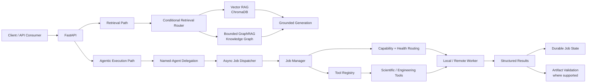
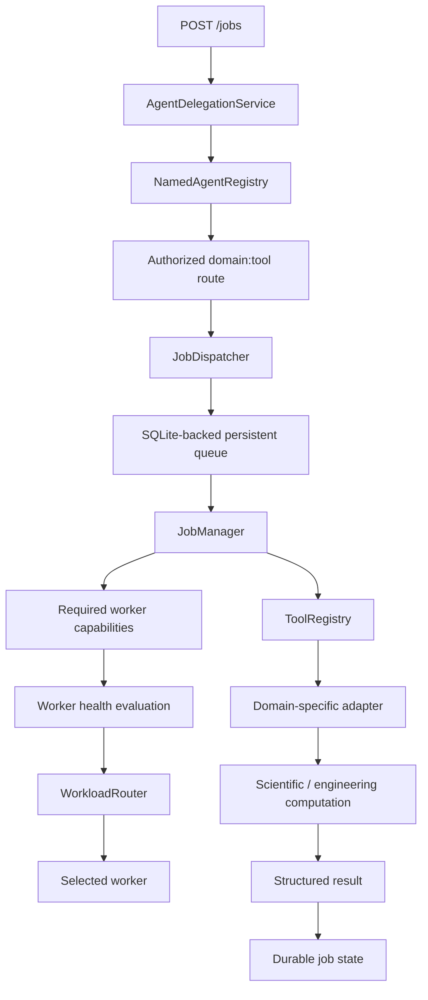
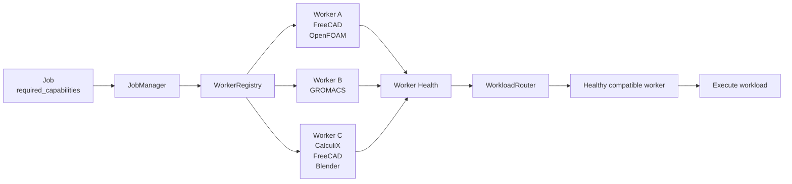
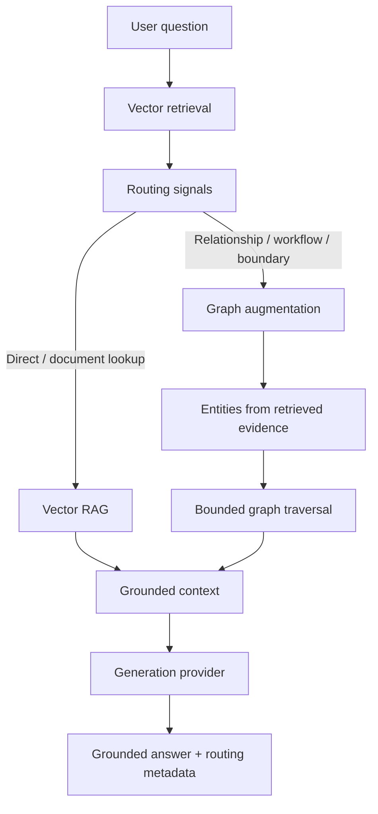
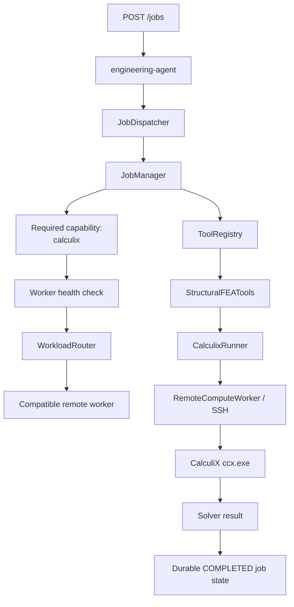
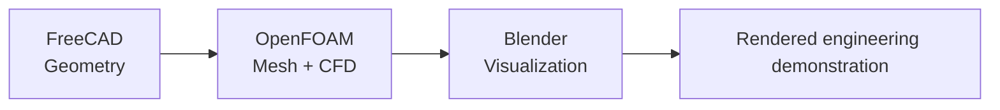
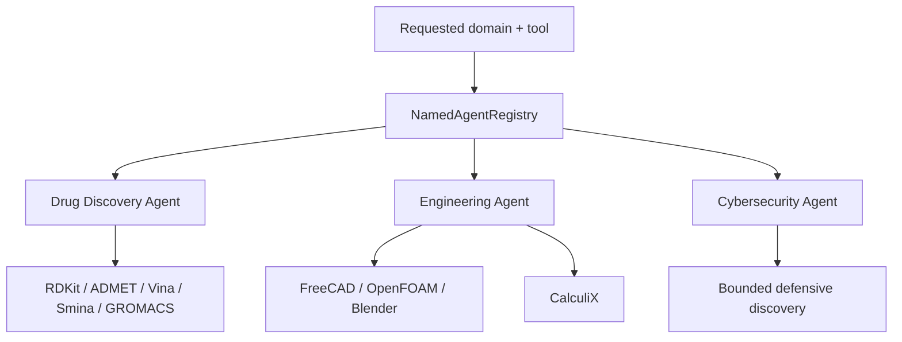
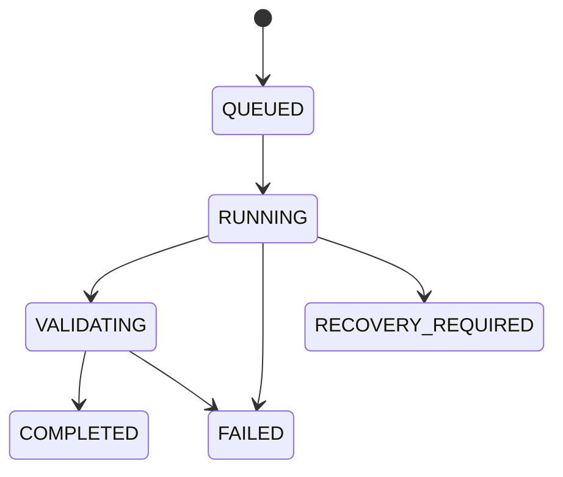

# Agentic GraphRAG Orchestration Platform for Scientific & Engineering Computing

[](https://github.com/syedkhadeermo/personal-graphrag-agent/actions/workflows/ci.yml)
[](LICENSE)

A production-oriented AI orchestration platform combining **Vector RAG, GraphRAG, named-agent delegation, durable asynchronous jobs, capability-aware worker routing, remote scientific computation, and validated artifact handling**.

The project is designed around two practical engineering questions:

1. **When does graph-enhanced retrieval provide enough value to justify its additional context and latency?**
2. **Can the same agentic orchestration architecture support substantially different computational domains without rewriting its generic execution layers?**

The current implementation spans:

- **Drug discovery** — RDKit, ADMET-AI, AutoDock Vina, Smina and GROMACS
- **CAD & CFD** — FreeCAD, OpenFOAM and Blender
- **Structural FEA** — CalculiX
- **Defensive cybersecurity** — bounded, explicitly authorized TCP discovery

The platform is intentionally not built around the assumption that GraphRAG is always superior to Vector RAG. An independent public-document pilot found stronger Vector RAG performance on direct questions and selective graph benefit on relationship-oriented boundary questions. The system therefore supports **conditional Vector/GraphRAG routing**.


---

## System at a glance



The retrieval and computational paths are separate but live behind the same platform boundary:

```text
Knowledge question
      |
      v
Conditional retrieval
      |
      +------> Vector RAG
      |
      +------> Vector RAG + bounded graph context
      |
      v
Grounded generation


Scientific / engineering job
      |
      v
Named-agent delegation
      |
      v
Persistent asynchronous job
      |
      v
Capability + worker-health routing
      |
      v
Domain tool adapter
      |
      v
Local / remote computation
      |
      v
Persisted result / validated artifact where supported
```

---

## Why this is more than a RAG demo

The repository combines retrieval with an execution architecture for real computational workloads.

It demonstrates:

- Metadata-filtered semantic retrieval over technical documents
- Persistent scientific relationships and focused multi-hop traversal
- Retrieval-seeded GraphRAG that avoids unrelated graph branches
- Conditional routing between Vector RAG and GraphRAG
- Named agents with explicit domain/tool authorization
- Persistent SQLite-backed jobs
- Asynchronous dispatch and atomic job claiming
- Retry and restart recovery behavior
- Capability-aware worker registration
- Worker-health-aware workload selection
- Local, Windows, WSL and SSH-based execution adapters
- SHA-256 artifact validation and manifest registration for supported workflows
- Provider-neutral grounded generation
- FastAPI discovery, submission and job-status interfaces
- Dockerized execution for portable workloads
- Terraform-based AWS deployment
- Bounded defensive cybersecurity automation
- Multiple scientific and engineering domains behind the same orchestration model

---

# Architecture

## 1. Agentic job execution

A computational request does not directly call a scientific executable.



This separation keeps generic orchestration logic independent from individual scientific applications.

---

## 2. Capability-aware worker routing

Workers advertise what they can execute.



Selection therefore depends on declared capabilities and worker health rather than hard-coding a specific machine into the generic routing algorithm.

Supported capability classes include:

```text
remote_command
freecad
blender
openfoam
gromacs
calculix
```

---

## 3. Conditional Vector RAG / GraphRAG

Graph context is added selectively rather than automatically.



The graph branch is **retrieval-seeded**: vector evidence identifies relevant entities before traversal. This reduces unrelated graph expansion.

---

# Structural FEA extensibility validation

Structural FEA was intentionally added after the core orchestration system already existed.

The objective was not to demonstrate high-fidelity finite-element validation. The objective was to test whether a substantially different computational mechanism could be incorporated **without introducing FEA-specific logic into the generic orchestration layers**.

The new integration added:

```text
Worker capability
    CALCULIX
        |
        v
Structural FEA domain facade
    StructuralFEATools
        |
        v
CalculiX execution adapter
    CalculixRunner
        |
        v
Tool registration
    structural_fea:calculix
        |
        v
Named-agent route
    engineering-agent
        |
        v
Runtime worker capability declaration
```

The following generic components required **no FEA-specific algorithm changes**:

```text
ToolRegistry
WorkerRegistry
WorkloadRouter
JobManager
JobDispatcher
JobStore
FastAPI job endpoints
AgentDelegationService
NamedAgentRegistry
RemoteComputeWorker
```

This provides a concrete extensibility result:

> A new Structural FEA computational mechanism was incorporated primarily through capability declaration, a domain-specific adapter, tool/agent registration and runtime composition, while preserving the generic orchestration algorithms.

## Verified CalculiX execution path

The complete asynchronous path was exercised:



The verified flow was:

```text
POST /jobs
    |
    v
AgentDelegationService
    |
    v
engineering-agent
    |
    v
JobDispatcher
    |
    v
JobManager
    |
    v
required capability: calculix
    |
    v
WorkerRegistry + health evaluation
    |
    v
WorkloadRouter
    |
    v
ToolRegistry
    |
    v
StructuralFEATools
    |
    v
CalculixRunner
    |
    v
RemoteComputeWorker
    |
    v
SSH
    |
    v
CalculiX
    |
    v
return_code = 0
    |
    v
COMPLETED
```

The initial cantilever case demonstrated successful solver execution and orchestration. It is **not presented as a numerically validated FEA benchmark**. CalculiX `.dat`, `.frd` and `.sta` files are also not yet claimed as validated artifacts through the generic artifact-registration pipeline.

This distinction is deliberate: **execution validation and numerical-model validation are different claims.**

---

# Verified workflows

## Drug discovery

The drug-discovery layer supports:

- RDKit molecular descriptors
- Canonical SMILES and molecular formula calculation
- Lipinski and Veber rule calculations
- ADMET-AI v2 prediction
- AutoDock Vina docking
- Smina docking
- GROMACS molecular-dynamics execution
- Scientific relationship representation in the knowledge graph

A curated graph can connect concepts such as:

```text
Candidate molecule
      |
      v
Screening / ADMET
      |
      v
Molecular docking
      |
      v
Docking pose
      |
      v
Protein-ligand complex
      |
      v
Molecular dynamics
      |
      +------> RMSD
      |
      +------> RMSF
```

Verified execution paths include direct tool execution, registry execution, asynchronous persistent jobs, named-agent delegation and API submission.

ADMET and toxicity outputs are computational predictions and are **not experimental or clinical conclusions**.

---

## CAD, CFD and visualization

A portfolio workflow executes across FreeCAD, OpenFOAM and Blender:



The demonstration workflow:

1. FreeCAD creates a **200 × 50 × 20 mm** rectangular flow domain.
2. OpenFOAM 12 generates and validates a **1,600-cell hexahedral mesh**.
3. A laminar simulation advances to **1 second** of simulated time.
4. Blender 5.0.1 generates a **96-frame visualization**.

Observed demonstration values:

| Metric | Result |
|---|---:|
| Mesh cells | 1,600 |
| Maximum mesh non-orthogonality | 0 |
| Maximum Courant number | approximately 0.551 |
| Mean final velocity magnitude | approximately 1.000 m/s |
| Maximum final velocity magnitude | approximately 1.100 m/s |

The reproducible demo source is under:

```text
demos/cad_flow_channel/
```

Generated frames, native CAD files and runtime simulation results are intentionally excluded from Git.

---

## Defensive cybersecurity

The cybersecurity domain demonstrates **bounded defensive automation**, not penetration testing.

It:

- Requires explicit authorization
- Accepts one private or loopback IP address
- Requires an explicit list of no more than 32 ports
- Rejects public IP addresses
- Rejects hostnames and network ranges
- Performs TCP connection checks only
- Produces informational findings and limitations
- Records NIST SP 800-115 discovery-phase methodology metadata

It performs no:

- Exploitation
- Authentication attempts
- Password testing
- Banner collection
- Unrestricted scanning

---

# GraphRAG evaluation

## Independent Vector RAG vs GraphRAG pilot

The repository contains a small independent benchmark using public documents, real Chroma retrieval and gold claims maintained separately from the curated knowledge graph.

The purpose is to evaluate retrieval behavior rather than construct a benchmark that assumes GraphRAG should win.

Representative result:

| Metric | Vector RAG | GraphRAG |
|---|---:|---:|
| Claim coverage | **0.667** | 0.639 |
| Average prompt tokens | **2,580** | 2,768 |
| Average answer tokens | **178** | 208 |
| Average generation latency | **23.1 s** | 28.0 s |

Retrieval source recall:

```text
0.778
```

Claim coverage by question category:

| Category | Questions | Vector RAG | GraphRAG |
|---|---:|---:|---:|
| Direct | 3 | **1.000** | 0.889 |
| Cross-source | 2 | 0.500 | 0.500 |
| Boundary | 1 | 0.000 | **0.167** |

The result does **not** establish a universal GraphRAG advantage.

Instead:

```text
Direct question
      |
      v
Vector retrieval usually sufficient
      |
      v
Lower context + lower latency


Relationship / boundary question
      |
      v
Vector retrieval
      +
bounded graph augmentation
      |
      v
Potential additional relationship evidence
```

In this pilot, Vector RAG was stronger and cheaper for direct questions. Graph augmentation showed selective benefit on the boundary question.

That observation motivated the conditional retrieval architecture.

The benchmark remains small and should be treated as an **engineering pilot**, not a general statistical conclusion about GraphRAG.

---

# GraphRAG behavior

Questions use conservative conditional retrieval.

Callers may select:

```text
auto
vector
graph
```

Every response records:

- Requested retrieval mode
- Selected retrieval mode
- Routing confidence
- Routing signals
- Recognized question entities

When graph retrieval is selected, vector retrieval first identifies relevant graph seeds.

Examples:

```text
ADMET question
    |
    v
ADMET-AI
    |
    +--> Chemprop
    +--> DILI
    +--> hERG
    +--> toxicity
    +--> cardiotoxicity
```

```text
Docking workflow question
    |
    v
Molecular docking
    |
    v
Docking pose
    |
    v
Protein-ligand complex
    |
    v
Molecular dynamics
    |
    +--> GROMACS
    +--> RMSD
    +--> RMSF
```

CAD questions remain within FreeCAD/OpenFOAM/Blender graph branches, while defensive-security questions remain within authorization, discovery, findings and remediation branches.

Metadata filters support:

- Domain
- Subdomain
- Tool
- Version
- Visibility
- Document type
- Source

---

# Named-agent delegation

Agents provide an authorization and routing layer between API requests and tools.

Conceptually:



This separates:

```text
Who may handle the request?
            |
            v
Named-agent authorization

What computation is required?
            |
            v
ToolRegistry

Where can it run?
            |
            v
WorkerRegistry + WorkloadRouter
```

---

# Persistent asynchronous jobs

Scientific computation is modeled as durable work rather than an in-memory function call.



The job layer provides:

- SQLite persistence
- Atomic queued-job claiming
- Asynchronous worker threads
- Attempt tracking
- Retry support
- Restart recovery
- Worker assignment
- Structured result persistence
- Job event recording
- Artifact handling where supported

This design deliberately favors conservative recovery behavior for expensive scientific workloads where accidental duplicate execution can be costly.

---

# API

The FastAPI service exposes health, capability discovery, named agents and persistent job operations.

## Job submission flow

```text
POST /jobs
    |
    v
named-agent delegation
    |
    v
SQLite-backed queue
    |
    v
asynchronous dispatcher
    |
    v
worker capability selection
    |
    v
domain tool
    |
    v
scientific computation
    |
    v
persisted structured result
    |
    v
GET /jobs/{job_id}
```

Useful endpoints:

```text
GET  /health
GET  /runtime
GET  /capabilities
GET  /agents
POST /jobs
GET  /jobs/{job_id}
```

Start locally:

```bash
export GRAPH_RAG_API_KEY="replace-with-a-long-random-value"
uvicorn app.api.main:app --host 0.0.0.0 --port 8000
```

Job endpoints accept the API key through the `X-API-Key` header.

Health and capability discovery remain public.

If `GRAPH_RAG_API_KEY` is unset, authentication is disabled for local/personal development. Do not expose an unauthenticated development instance to an untrusted network.

CORS defaults to local UI origins. Configure `GRAPH_RAG_CORS_ORIGINS` with an explicit comma-separated allowlist when required.

---

# Remote scientific-compute workers

Remote workers are configured through environment variables rather than repository-specific host configuration.

```bash
export GRAPH_RAG_REMOTE_HOST="your-worker-host"
export GRAPH_RAG_REMOTE_USERNAME="your-worker-user"
export GRAPH_RAG_REMOTE_WORKER_ID="remote-compute"
export GRAPH_RAG_REMOTE_HOSTNAME="optional-hostname"
```

When a remote worker is configured, the runtime can register capabilities such as:

```text
REMOTE_COMMAND
FREECAD
BLENDER
OPENFOAM
GROMACS
CALCULIX
```

If remote configuration is absent, the API can still initialize without registering a remote compute worker.

For the new Structural FEA adapter, attempted CalculiX execution without the required remote configuration fails explicitly rather than silently falling back to a personal machine address.

---

# Artifact handling

Supported workflows can register and validate generated artifacts using SHA-256 metadata.

Conceptually:

```text
Scientific computation
        |
        v
Expected artifact
        |
        v
Existence / metadata checks
        |
        v
SHA-256
        |
        v
Artifact manifest
        |
        v
Persisted job evidence
```

Artifact validation is workflow-dependent.

The current CalculiX integration verifies remote solver execution and durable job completion, but its `.dat`, `.frd` and `.sta` outputs are **not yet represented as validated artifacts through this generic pipeline**.

---

# Generation providers

Grounded answer generation is provider-neutral.

Supported generation backends include:

- Ollama
- OpenAI
- Anthropic
- Google Gemini

Ollama remains the default local provider and requires no cloud credentials:

```bash
export GENERATION_PROVIDER="ollama"
export OLLAMA_GENERATION_MODEL="deepseek-coder:6.7b"
```

Cloud generation can be configured through environment variables:

```bash
# OpenAI
export GENERATION_PROVIDER="openai"
export OPENAI_API_KEY="..."
export OPENAI_MODEL="your-openai-model"

# Anthropic
export GENERATION_PROVIDER="anthropic"
export ANTHROPIC_API_KEY="..."
export ANTHROPIC_MODEL="your-anthropic-model"

# Google Gemini
export GENERATION_PROVIDER="gemini"
export GEMINI_API_KEY="..."
export GEMINI_MODEL="your-gemini-model"
```

`GENERATION_MODEL` may replace the provider-specific model variable.

API keys are read from the environment and must not be committed.

The generation abstraction affects grounded text generation only. Ingestion and retrieval continue to use the configured local embedding model, allowing existing Chroma collections to remain compatible.

---

# Docker

Build and start the API:

```bash
docker compose build
docker compose up -d
```

Verify:

```bash
curl http://localhost:8000/health
curl http://localhost:8000/capabilities
```

The verified Docker image executes portable workloads such as RDKit locally inside the container.

Remote CAD, CFD, FEA and other machine-specific scientific workloads require an appropriately configured worker and are not expected to execute inside the base container.

---

# Local development

## Requirements

Core development:

- Python 3.12
- ChromaDB
- Ollama for local embeddings/generation

Optional scientific environments:

- RDKit
- ADMET-AI
- GROMACS
- AutoDock Vina / Smina
- FreeCAD
- OpenFOAM
- Blender
- CalculiX
- SSH-accessible scientific-compute worker

## Windows setup

```cmd
python -m venv .venv
.venv\Scripts\activate
python -m pip install -r requirements.txt
```

Optional scientific/PyTorch stack:

```cmd
python -m pip install -r requirements-sci.txt
```

Development and CI
