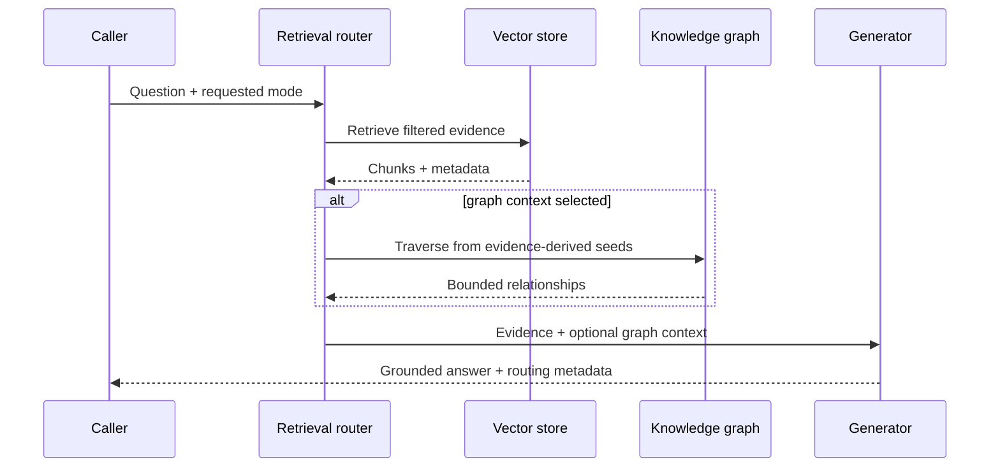
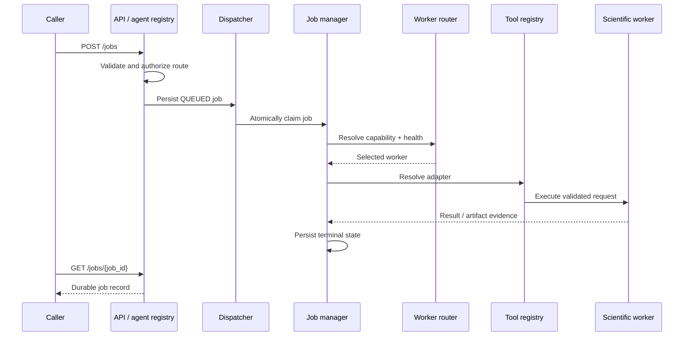
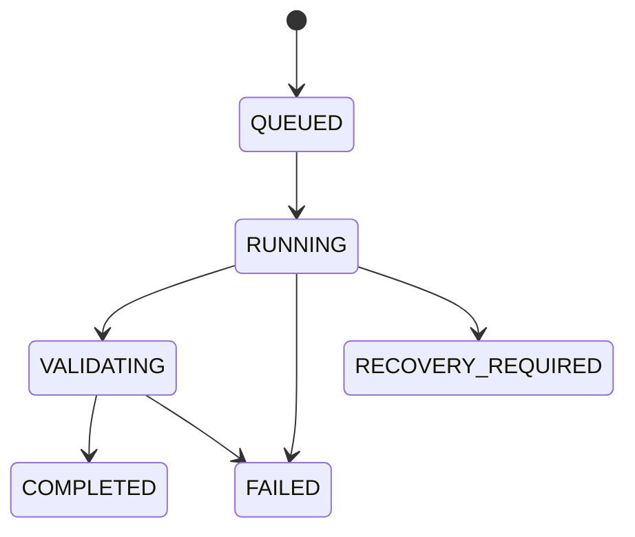

# Architecture

## Design goal

The system separates knowledge retrieval from computational execution while exposing both through one API boundary. Generic orchestration decides who may handle a request, where it can run, and how its state is persisted. Domain adapters decide how a specific scientific application is invoked.

## Component model

| Component | Responsibility |
|---|---|
| FastAPI application | Input validation, discovery endpoints, job submission, status reads, and API-key enforcement |
| Conditional retrieval router | Chooses vector-only or graph-augmented retrieval |
| Vector store | Retrieves document evidence with metadata filters |
| Knowledge graph | Provides bounded relationship context seeded from retrieved evidence |
| Generation provider | Produces grounded text using the assembled context |
| Named-agent registry | Authorizes explicit `domain:tool` routes |
| Job dispatcher | Polls, atomically claims, and submits durable queued work |
| Job manager | Applies state transitions, retries, worker selection, execution, and artifact handling |
| Job store | Persists jobs, attempts, events, results, and errors in SQLite |
| Worker registry | Records capabilities and worker identity |
| Worker-health service | Evaluates whether a worker is currently eligible |
| Workload router | Selects a healthy worker that satisfies required capabilities |
| Tool registry | Resolves domain/tool names to adapters |
| Domain adapter | Validates domain inputs and invokes a local or remote application |
| Artifact manifest | Records supported outputs and SHA-256 evidence |

## Retrieval lifecycle

Graph context is not a replacement for vector retrieval. Vector evidence establishes the relevant neighborhood before graph traversal.

## Computational-job lifecycle

## Job-state model

The persistent state machine distinguishes execution from validation:

Restart recovery is conservative. A stale job is not blindly executed again when doing so could duplicate an expensive or non-idempotent scientific workload.

## Adding a computational domain

A new integration should normally require:

1. A normalized worker capability.
2. A domain-specific input-validation facade.
3. A runner or adapter for the executable.
4. Tool-registry registration.
5. A named-agent authorization route.
6. Runtime worker capability configuration.
7. Portable unit tests and clearly marked external integration tests.
8. Documentation that distinguishes execution evidence from scientific validation.

The addition should not introduce domain-specific branches into the dispatcher, job store, generic worker router, or API job endpoints.

## Persistence choice

SQLite provides durable state, atomic job claiming, simple local operation, and inspectable portfolio evidence without introducing a separate service. This is appropriate for a single API instance and a small worker pool.

A distributed, horizontally scaled deployment would require a transactional shared database and queue design with explicit leases, idempotency, and concurrency semantics. The current repository does not claim that deployment model.
